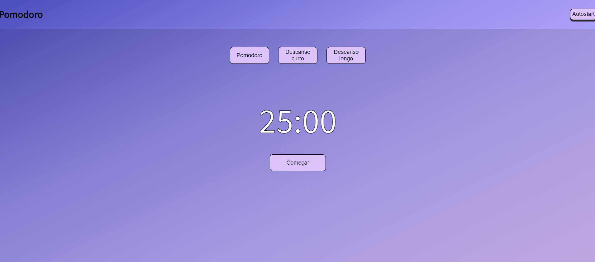

<h1>Pomodoro</h1>

<h2>
    
</h2>

<h2>Tabela de conteúdos</h2>

<ul>
	<li><a href="#sobre">Sobre</a></li>
    <li><a href="#funcionalidades">Funcionalidades</a></li>
    <li><a href="#site">Site</a></li>
    <li><a href="#tecnologias">Tecnologias</a></li>
</ul>

<h2 align="center" id="sobre">Sobre</h2>

Um pomodoro nada mais é do que um método de gerenciamento de tempo desenvolvido por Francesco Cirillo no final dos anos 1980. 
A técnica consiste na utilização de um cronômetro para dividir o trabalho em períodos de 25 minutos, separados por breves intervalos.
Nesse projeto em específico a cada período de 25 minutos concluído você pode descansar 5 minutos, e a cada 3 períodos de 25 minutos você pode descansar 15 minutos.
Você pode ler mais sobre o método pomodoro <a href="https://www.napratica.org.br/pomodoro/" target="_blank">aqui</a>

<h2 align="center" id="funcionalidades">Funcionalidades</h2>

- [x] Sempre que o cronômetro chega em "0" um alarme é tocado para alertar o usuário
   

- [x] Caso o cronômetro esteja rodando e o usuário tente mudar de seção, um alerta aparece falando que caso o usuário aperte em "OK" o progresso será perdido
   

- [x] O botão "autostart" serve para começar o próximo turno automaticamente sempre que o cronômetro chegue em "0". Caso desativado, o usuário terá que iniciar manualmente apertando no botão "Começar"
   

- [x] Quando o cronômetro está rodando uma mensagem é exibida de acordo com a seção atual. Ex: na seção "Pomodoro" é exibida a mensagem "HORA DO TRABALHO, MANTENHA-SE FOCADO!"

<h2 align="center" id="site">Site para utilização deste pomodoro</h2> 

<a href="https://trusting-ardinghelli-1a7afd.netlify.app/" target="_blank">Clique aqui</a>

<h2 align="center" id="tecnologias">Tecnologias utilizadas nesse projeto</h2>
<ul>
  <li>HTML</li>
  <li>CSS</li>
  <li>JavaScript</li>
</ul>

 

<h3>Made with :heart: by Elivelton</h3>
